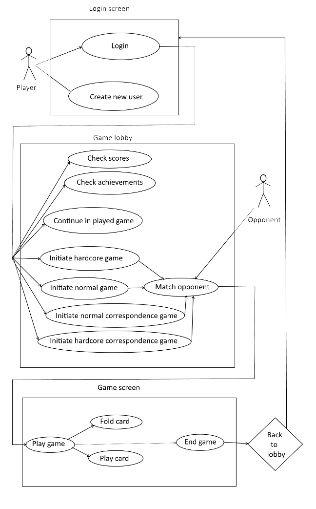

# Ants- remake

## Základný popis a cieľ aplikácie

Aplikácia je remakom a rozšírením kultovej Českej hry [Mravenci](http://mravenci.qex.cz), inšpirovanej hrou [Arcomage](https://en.wikipedia.org/wiki/Arcomage). Aplikácia bude obsahovať okrem samotnej hry aj systém achievementov, rebríčkov a taktiež možnosť hry viac hráčov online, čim sa zvýši atraktívnosť samotnej hry.

### Cieľová skupina

Cieľovou skupinou sú milovníci nostalgie a starí hráči Mravencov ako aj noví hráči, ktorí majú chuť odreagovať sa pri hraní nenáročnej a zábavnej hry.

## Use cases

#### Módy hry
   - **Klasický** Vyhráva ten, kto prvý postaví hrad výšky 100 alebo zničí súperov hrad na 0.
   - **Hardcore** Vyhráva hráč, ktorého hrad dosiahne výšku o 100 viac ako súperov.

#### Typy hry
  - **Korešpondenčná** - dá sa hrať viacero hier naraz. Ťahy sú bez obmedzenia.
  - **Real time** - musí sa skončiť a dá sa hrať iba jedna naraz.

#### Fázy aplikácie
  - **Úvodná prihlasovacia obrazovka** Používateľ sa môže registrovať či prihlásiť.
  - **Game lobby** Hráč vidí svoje rozohraté korešpondenčné partie, rebríček top hráčov a svoje achievementy či informácie o poslednej dokončenej partií. Môže tiež iniciovať novú hru.
  - **Hracia obrazovka** Spoločná pre každý mód aj druh hry. Tu hráč vykonáva svoje ťahy. Rozhranie bude pravdepodobne rovnaké ako v pôvodných mravencoch, s tým rozdielom, že grafika bude lepšia.

Skóre bude implementované pravdepodobne systémom +2 za výhru, +1 za remízu a -1 za prehru. Samotná logika hry vrátane sady kariet bude rovnaká ako v originálnych Mravencoch.

#### Zoznam plánovaných achievementov

  - Rank
    - Cadet
    - 1st class soldier *(1 win)*
    - 2nd class soldier *(10 wins)*
    - Lance corporal *(20 wins)*
    - Corporal *(30 wins)*
    - Sergeant *(50 wins)*
    - Skipper *(70 wins)*
    - Sergeant major *(90 wins)*
    - Warrant Officer *(100 wins)*
    - Ensign *(120 wins)*
    - Lieutenant *(150 wins)*
    - First Lieutenant *(200 wins)*
    - Captain *(250 wins)*
    - Colonel *(300 wins)*
    - Brigadier general *(400 wins)*
    - General *(500 wins)*
  - Prvá výhra
  - Prvá výhra zničením
  - Prvá výhra stavaním
  - Prvá remíza
  - Prvá prehra
  - Hrad nad 100
  - Hrad pod 0
  - Hrad nad 500
  - 2 krát kliadba v jednej hre
  - 2 krát zlodej v jednej hre
  - Použitý Babylon
  - 5 mágov v jednej hre
  - 5 vojakov v jednej hre
  - 5 stavitelov v jednej hre
  - 10 prehier
  - 50 prehier
  - 100 prehier
  - Hráč dostal kliadbu
  - Hráč dostal smrtku
  - 50 zbraní naraz v jednej hre
  - Prvý korešpondenčný duel
  - Výhra z hradu pod 20
  - Útok z hradu pod 10
  - Útok z hradu pod 5
  - Hradba nad 100
  - Skóre nad 100
  - Skóre nad 1000

## Databáza

Tabuľka userov spolu so skóre a záležitosťami pre matchmaking.

Tabuľka achievementov a tabuľka many to many users_achievements.

Tabuľka zápasov - či je zápas korešpondenčný, aktuálny stav hry, kto je na ťahu a pod.

Tabuľka kariet - karta, jej vzácnosť a vlastnosti. Umožňuje jednoducho meniť balíčky bez väčších zmien kódu

## Použité technológie

Pri vývoji aplikácie plánujem využiť framework React (asi v16.2.0 - zdá sa mi vhodný, pretože grafická stránka hry nie je tak náročná, aby vyžadovala sofistikované používanie canvasu) pre klientskú časť a NodeJS(v8.11.0) s relačnou DB podľa výberu v podľa možnosti najnovšej stabilnej verzii pre server. Komunikácia bude prostredníctvom AJAXu. (S NodeJS ani s Reactom som ešte nerobil, tak v prípade problémov skúsim pre server ako náhradu Python s Flaskom alebo v najhoršom PHP )

Z prehliadačov plánujem podporovať najmä nové verzie Firefoxu a Chromu.

## Časový plán

  - cca. do *3.4.* spustiť všetky potrebné komponenty
  - cca do *15.4.* implementovať základnú logiku hry, komunikáciu so serverom
  - cca fo *14.5.* doladiť grafiku, zvuky, gameplay a pod.

## Možné rozšírenia

Podobne ako v rôznych iných hrách založených na Arcomage je možné pridaním dodatkov do samotnej hernej logiky zvýšiť náročnosť a komplexnosť hry. Tieto dodatky sú vo forme pridania kariet do hracieho balíčka, pričom karty sú rôznym spôsobom kombinovateľné, obsahujú conditions (efekt karty závisí od predch. hracej karty či herného stavu) a pod. Taktiež je možné pridať nové herné staty či zmeniť výherné kritériá.

V záujme motivovania hráčov je možné pridať ďalšie achievementy. Taktiež je možné zlepšiť správanie systému, keď je nedostatok hráčov online. V prípade, že nejaký hráč čaká na oponenta určitý čas a stále nie je možné mu niekoho prideliť, mohol by mu server prideliť AI oponenta. Možnosťou je aj umožniť hráčom vyzývať sa navzájom, nie len pomocou náhodného pridelenia serverom. Rebríčky by mohli byť implementované pomocou ELO systému a rozdelené podľa lokalizácie hráča.
