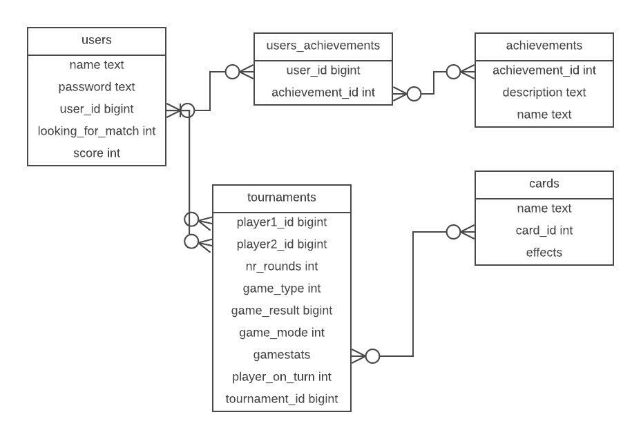

# Ants- remake

## Základný popis a cieľ aplikácie

Aplikácia je remakom a rozšírením kultovej Českej hry [Mravenci](http://mravenci.qex.cz), inšpirovanej hrou [Arcomage](https://en.wikipedia.org/wiki/Arcomage). Aplikácia bude obsahovať okrem samotnej hry aj systém achievementov, rebríčkov a taktiež možnosť hry viac hráčov online, čim sa zvýši atraktívnosť samotnej hry.

### Cieľová skupina

Cieľovou skupinou sú milovníci nostalgie a starí hráči Mravencov ako aj noví hráči, ktorí majú chuť odreagovať sa pri hraní nenáročnej a zábavnej hry.

## Use cases

V aplikácii existuje iba jeden druh používateľa - hráč.

#### Fázy aplikácie
  - **Úvodná prihlasovacia obrazovka** Používateľ sa môže registrovať či prihlásiť.
  - **Game lobby** Hráč vidí svoje rozohraté korešpondenčné partie, rebríček top hráčov a svoje achievementy či informácie o poslednej dokončenej partií. Môže tiež iniciovať novú hru podľa svojho výberu alebo odohrať ťah v niektorej zo svojich korešpondenčných partií. V prvom prípade hráč čaká, dokiaľ mu server nenájde oponenta, aby s ním mohol hrať a až potom sa otvorí hracia obrazovka. V druhom prípade sa hracia obrazovka rovno otvorí, vzhľadom k tomu, že na odohratie korešpondenčného ťahu nie je potrebné, aby boli obaja používatelia naraz prítomní.
  - **Hracia obrazovka** Spoločná pre každý mód aj druh hry. Tu hráč vykonáva svoje ťahy. Rozhranie bude pravdepodobne rovnaké ako v pôvodných mravencoch, s tým rozdielom, že grafika bude lepšia.

Samotná logika hry vrátane sady kariet bude rovnaká ako v originálnych Mravencoch. Znamené to, že každý hráč má na začiatku po 8 kariet a počiatočné množstvo surovín. Hráči sa na ťahoch striedajú. Pred každým ťahom sa hráčovi pripočíta adekvátne množstvo surovín podľa toho, aké zdroje má. Na ťahu môže hráč zahrať (ak má dostatok surovín) alebo odložiť jednu zo svojich kariet a dostať za ňu náhradnú. Hráč môže počas svojho ťahu aj ponúknuť remízu, ktorou sa partia skončí, ak sa na nej obaja hráči dohodnú. Za odohraté partie dostávajú hráči skóre, na základe ktorého sa vypočítava ich umiestnenie v tabuľke. Skóre bude implementované pravdepodobne systémom +2 za výhru, +1 za remízu a -1 za prehru, pričom tabuľka bude obsahovať aj informácie o počte prehier, výhier a remíz. Okrem skóre budú hráči na základe svojej hry získavať aj achievementy.

#### Zoznam plánovaných achievementov

  - Rank
    - Cadet
    - 1st class soldier *(1 win)*
    - 2nd class soldier *(10 wins)*
    - Lance corporal *(20 wins)*
    - Corporal *(30 wins)*
    - Sergeant *(50 wins)*
    - Skipper *(70 wins)*
    - Sergeant major *(90 wins)*
    - Warrant Officer *(100 wins)*
    - Ensign *(120 wins)*
    - Lieutenant *(150 wins)*
    - First Lieutenant *(200 wins)*
    - Captain *(250 wins)*
    - Colonel *(300 wins)*
    - Brigadier general *(400 wins)*
    - General *(500 wins)*
  - Prvá výhra
  - Prvá výhra zničením
  - Prvá výhra stavaním
  - Prvá remíza
  - Prvá prehra
  - Hrad nad 100
  - Hrad pod 0
  - Hrad nad 500
  - 2 krát kliadba v jednej hre
  - 2 krát zlodej v jednej hre
  - Použitý Babylon
  - 5 mágov v jednej hre
  - 5 vojakov v jednej hre
  - 5 staviteľov v jednej hre
  - 10 prehier
  - 50 prehier
  - 100 prehier
  - Hráč dostal kliadbu
  - Hráč dostal smrtku
  - 50 zbraní naraz v jednej hre
  - Prvý korešpondenčný duel
  - Výhra z hradu pod 20
  - Útok z hradu pod 10
  - Útok z hradu pod 5
  - Hradba nad 100
  - Skóre nad 100
  - Skóre nad 1000

#### Módy hry
   - **Klasický** Vyhráva ten, kto prvý postaví hrad výšky 100 alebo zničí súperov hrad na 0.
   - **Hardcore** Vyhráva hráč, ktorého hrad dosiahne výšku o 100 viac ako súperov.

#### Typy hry
  - **Korešpondenčná** - dá sa hrať viacero hier naraz. Ťahy sú bez obmedzenia.
  - **Real time** - musí sa skončiť a dá sa hrať iba jedna naraz.

## Databáza

Databáza bude obsahovať nasledujúcich 5 tabuliek:

  - **users** Obsahuje prihlasovacie údaje používateľov spolu s informáciami o skóre a údajmi pomáhajúcimi pri hľadaní partnera do hry.
  - **achievements** Obsahuje podstatné informácie pre každý achievement. Vďaka tejto tabuľke je možné achievementy meniť a pridávať bez väčších zásahov do kódu.
  - **users_achievements** tabuľka určená na uchovávanie vzťahov medzi používateľmi a ich získanými achievementami
  - **cards** Obsahuje informácie o každej karte. Pomocou card_id sa pravdepodobne budú identifikovať resources pre kartu, ako sú zvuky či obrázky. Samotný spôsob reprezentácie efektov danej karty v databáze ešte nie je jednoznačne určený - v závislosti od toho, ktorý spôsob bude výhodnejší môžem efekty rozdeliť do viacerých stĺpcov, alebo vhodnú dátovú štruktúru s ich reprezentáciou.  serializovať a uchovať v databáze ako jeden string. Motiváciou pre túto tabuľku je opäť flexibilita v menení a pridávaní kariet.
  - **tournaments** Obsahuje informácie o prebiehajúcich alebo ukončených hrách. Pre každú hru obsahuje aktuálny stav - tj. počet zdrojov, surovín a aktuálne držané karty pre každého hráča. Spôsob uloženia týchto dát je ešte stále otázny, rovnako ako pri efektoch kariet.

## Použité technológie

Pri vývoji aplikácie plánujem využiť framework React (asi v16.2.0 - zdá sa mi vhodný, pretože grafická stránka hry nie je tak náročná, aby vyžadovala sofistikované používanie canvasu) pre klientskú časť a NodeJS(v8.11.0) s relačnou DB podľa výberu v podľa možnosti najnovšej stabilnej verzii pre server. Komunikácia bude prostredníctvom AJAXu. (S NodeJS ani s Reactom som ešte nerobil, tak v prípade problémov skúsim pre server ako náhradu Python s Flaskom alebo v najhoršom PHP )

Z prehliadačov plánujem podporovať najmä nové verzie Firefoxu a Chromu.

## Časový plán

  - cca. do *3.4.* spustiť všetky potrebné komponenty na vývoj
  - cca do *15.4.* implementovať základnú logiku hry a komunikáciu so serverom
  - cca do *14.5.* doladiť grafiku, zvuky, vybalancovať gameplay a pod.

## Možné rozšírenia

Podobne ako v rôznych iných hrách založených na Arcomage je možné pridaním dodatkov do samotnej hernej logiky zvýšiť náročnosť a komplexnosť hry. Tieto dodatky sú vo forme pridania kariet do hracieho balíčka, pričom nové karty sú rôznym spôsobom kombinovateľné, obsahujú conditions (efekt karty závisí od predch. hracej karty či herného stavu) a pod. Taktiež je možné pridať nové herné staty či zmeniť výherné kritériá.

V záujme motivovania hráčov je možné pridať ďalšie achievementy. Taktiež je možné zlepšiť správanie systému, keď je nedostatok hráčov online. V prípade, že nejaký hráč čaká na oponenta určitý čas a stále nie je možné mu niekoho prideliť, mohol by mu server prideliť AI oponenta. Možnosťou je aj umožniť hráčom vyzývať sa navzájom, nie len pomocou náhodného pridelenia serverom. Rebríčky by mohli byť implementované pomocou ELO systému a rozdelené podľa lokalizácie hráča.
